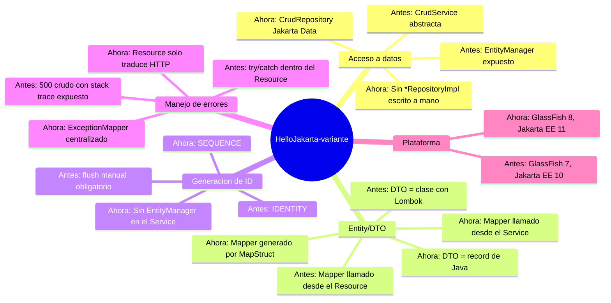
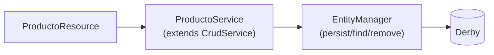
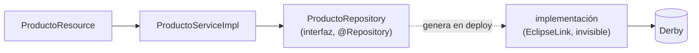
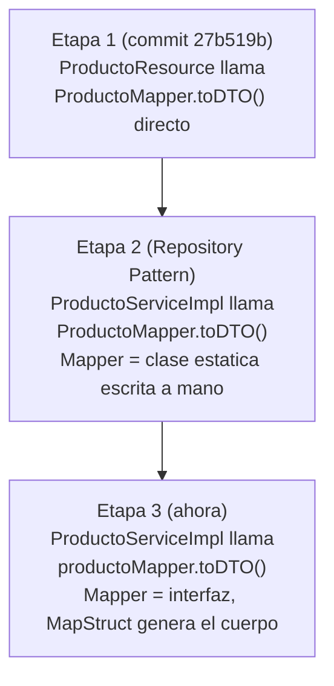
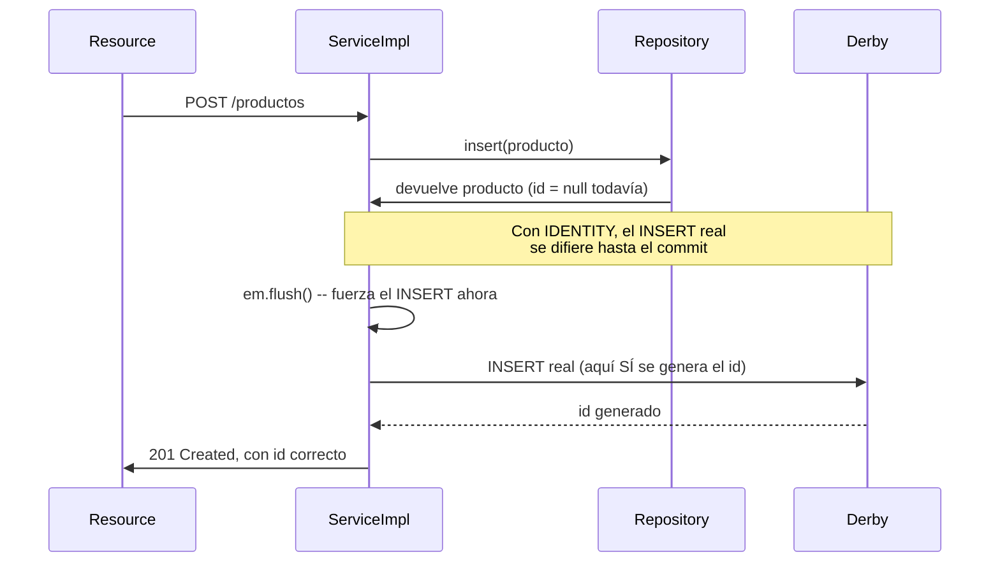
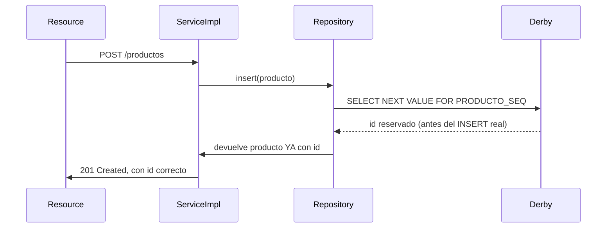
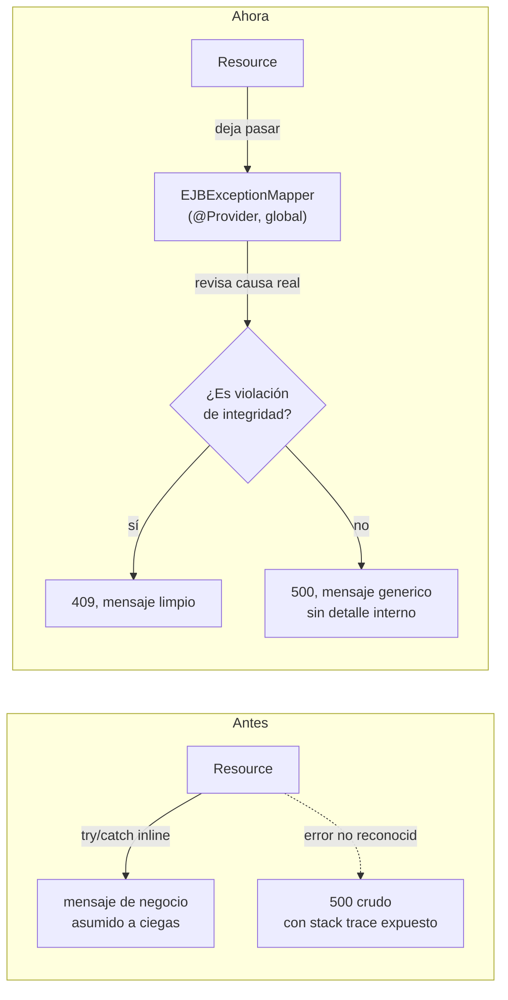

# Evolución de la arquitectura — Antes vs Ahora

Este documento compara el backend en dos momentos: cómo empezó el proyecto (primer CRUD
funcional de `Producto`) contra cómo quedó después de las migraciones a Repository Pattern,
Jakarta Data, MapStruct/records y `SEQUENCE`. Todo lo de "antes" está sacado de commits
reales del repo (`git show 27b519b`, el primer CRUD completo), no es una reconstrucción de
memoria. Todo lo de "ahora" está verificado con `curl` contra GlassFish 8 real — ver el
detalle incidente por incidente en `bitacora-fixes.md` (#10 a #15).

---

## Mapa mental general



---

## 1. Acceso a datos: de `CrudService` a `CrudRepository`

### Cómo era

Una sola clase abstracta hacía TODO: era el `EntityManager`, la lógica CRUD genérica, y la
clase que los `Service` concretos extendían directamente. No existía una capa `Repository`
separada — `ProductoService` heredaba de `CrudService<Producto, Long>` y ya.

```java
// service/CrudService.java (commit 27b519b, el primer CRUD funcional)
public abstract class CrudService<T, ID> {
    @PersistenceContext(unitName = "HelloJakartaPU")
    protected EntityManager em;

    protected abstract Class<T> getEntityClass();

    public T crear(T entidad) {
        em.persist(entidad);
        return entidad;
    }
    // ... listar, buscarPorId, actualizar, eliminar
}

// service/ProductoService.java
@Stateless
public class ProductoService extends CrudService<Producto, Long> {
    @Override
    protected Class<Producto> getEntityClass() { return Producto.class; }
}
```



### Cómo quedó

`Repository` y `Service` son dos interfaces separadas. `ProductoRepository` es una interfaz
vacía que extiende `CrudRepository<Producto, Long>` — **no existe ningún archivo con la
implementación**, el proveedor (EclipseLink) la genera sola en tiempo de despliegue.

```java
// lib/ProductoRepository.java -- este archivo esta COMPLETO, no falta nada
@Repository
public interface ProductoRepository extends CrudRepository<Producto, Long> {
}

// ejb/ProductoServiceImpl.java
@Stateless
public class ProductoServiceImpl implements ProductoService {
    @Inject
    private ProductoRepository productoRepository;   // el proveedor resuelve la implementacion
}
```



### Comparación

| Aspecto | Antes (`CrudService`) | Ahora (`CrudRepository`) |
|---|---|---|
| Quién escribe la implementación CRUD | Tú, en `CrudService` (una vez) | Nadie — la genera el proveedor |
| `EntityManager` visible desde | El `Service` mismo (herencia directa) | En ningún `ServiceImpl` de Producto/Factura |
| Relación Service↔acceso a datos | Herencia (`extends CrudService`) | Composición + inyección (`@Inject Repository`) |
| Cómo se agrega una entidad nueva | Copiar patrón de herencia + `getEntityClass()` | Una interfaz vacía con una línea |
| Especificación | Ninguna — patrón casero | Jakarta Data 1.0 (estándar Jakarta EE 11) |

**Por qué es mejor**: con herencia, el `Service` queda acoplado para siempre a los
detalles de cómo se persiste (`EntityManager`, JPQL armado a mano). Con `CrudRepository`,
el `Service` solo conoce un contrato (`insert`, `findById`, `update`, `deleteById`) — de
dónde salen esos datos es un detalle de infraestructura, reemplazable sin tocar una línea
de lógica de negocio. Es la misma razón por la que en tu trabajo real
(`Conesteejemploveoqueelpatrón.txt`) el `Service` inyecta el `Repository` por interfaz, no
lo extiende.

---

## 2. Traducción Entity↔DTO: del Resource, al Service, a MapStruct

### Línea de tiempo



### Comparación

| Aspecto | Etapa 1 (Resource) | Etapa 2 (Service, manual) | Etapa 3 (ahora: Service + MapStruct) |
|---|---|---|---|
| Quién mapea | El `Resource` mismo | El `ServiceImpl` | El `ServiceImpl`, delegando a MapStruct |
| El `Resource` conoce el `Mapper` | Sí | No | No |
| Código del `Mapper` | Escrito a mano | Escrito a mano | Generado en `target/generated-sources/` |
| Mapeo de campo anidado (`producto.id` → `productoId`) | A mano, dentro del `Resource` | A mano, dentro del `Mapper` | `@Mapping(source = "producto.id")`, una línea |
| Riesgo de error al agregar un campo | Alto (fácil de olvidar en 2 lugares) | Medio | Bajo (MapStruct avisa en compilación si algo no mapea) |

**Por qué es mejor**: mover el mapeo del `Resource` al `Service` ya fue una mejora real
(el `Resource` dejó de saber qué es una `Entity`). MapStruct es el siguiente paso lógico:
el código de mapeo es mecánico y repetitivo — perfecto para generar, no para mantener a
mano. Si mañana agregas un campo a `Producto` y se te olvida en el `Mapper`, con código
manual el bug pasa desapercibido; con MapStruct, si el campo no tiene forma de mapearse,
**falla la compilación**, no en producción.

---

## 3. DTOs: de clases con Lombok a `record`

| Aspecto | Antes (clase + Lombok) | Ahora (`record`) |
|---|---|---|
| Mutabilidad | Mutable (`setNombre()` disponible siempre) | Inmutable — se construye completo, una sola vez |
| Accessors | `@Getter`/`@Setter` generados por Lombok | Generados por el compilador de Java, sin librería externa |
| Sintaxis de acceso | `dto.getNombre()` | `dto.nombre()` |
| Dependencia externa | Lombok (`@Getter @Setter @NoArgsConstructor`) | Ninguna (parte del lenguaje desde Java 16) |
| `equals`/`hashCode`/`toString` | Generados por Lombok (si se pide) | Generados automáticamente, siempre |

```java
// Antes
@Getter @Setter @NoArgsConstructor
public class ProductoDTO {
    private Long id;
    @NotBlank private String nombre;
    // ...
}

// Ahora
public record ProductoDTO(
        Long id,
        @NotBlank String nombre,
        // ...
) {}
```

**Por qué es mejor**: un DTO no debería poder mutarse a medias después de construido — es
un contrato de datos, no un objeto con estado propio. Con la clase mutable, nada impedía
crear un `ProductoDTO` vacío e ir llenándolo campo por campo en cualquier orden, incluso
dejarlo a medias. Con `record`, o se construye completo o no compila — el propio lenguaje
impone la garantía que antes dependía de la disciplina de quien escribía el código.

---

## 4. Plataforma: GlassFish 7 / Jakarta EE 10 → GlassFish 8 / Jakarta EE 11

| Aspecto | Antes | Ahora |
|---|---|---|
| Servidor | GlassFish 7.0.26 | GlassFish 8.0.4 |
| JDK | 17 | 21 |
| Especificación Jakarta EE | 10 | 11 |
| `jakarta.data-api` (Jakarta Data) | No existe en esta plataforma | Incluido |
| EclipseLink | 4.0.5 | 5.0.1 |
| Jakarta Persistence | 3.1 | 3.2 |

**Por qué fue necesario, no opcional**: `CrudRepository` es parte de **Jakarta Data**, un
módulo que se estrenó en Jakarta EE 11 — verificado revisando los módulos instalados de
GlassFish 7 (no existe ningún jar `jakarta.data*` ahí). No había forma de usar
`CrudRepository` de verdad sin subir de plataforma; por eso se instaló GlassFish 8 en
paralelo (GlassFish 7 se dejó intacto, sin tocar). Detalle completo en `bitacora-fixes.md`
incidente #11.

---

## 5. Generación de ID: `IDENTITY` + flush manual → `SEQUENCE` sin flush

### El problema real que había



Sin el `em.flush()`, la respuesta del `POST` volvía con `id: null` — comprobado con `curl`,
4 peticiones reales, 4 veces `null` sin el flush.

### Cómo quedó



### Comparación

| Aspecto | Antes (`IDENTITY`) | Ahora (`SEQUENCE`) |
|---|---|---|
| Cuándo se conoce el id | Después del `INSERT` real (commit) | Antes del `INSERT` (vía `nextval`) |
| ¿Hace falta `EntityManager` en el `ServiceImpl`? | Sí, solo para forzar `flush()` | No |
| ¿Hace falta `flush()` manual? | Sí | No |
| Objeto extra en el esquema de la base | Ninguno | Una secuencia por entidad (`PRODUCTO_SEQ`, etc.) |
| Legibilidad del `ServiceImpl.crear()` | Una línea extra que hay que explicar con comentario | Trivial: `repository.insert(entidad)` y ya |

**Por qué es mejor**: `IDENTITY` obliga a elegir entre dos males — devolver el `id` como
`null` en la respuesta (mala experiencia de API), o meter `EntityManager`+`flush()` en
cada `Service` que crea entidades (una fuga de un detalle de bajo nivel hacia una capa que
se supone no debería conocerlo). `SEQUENCE` elimina el problema de raíz: el id ya viene
poblado por diseño, no hay nada que forzar. El costo es un cambio de esquema (hubo que
borrar y regenerar las tablas afectadas — ver incidente #15), pagado una sola vez.

---

## 6. Manejo de errores: `try/catch` en el Resource → `ExceptionMapper`

### Cómo era

```java
@DELETE
@Path("/{id}")
public Response eliminar(@PathParam("id") Long id) {
    try {
        boolean eliminado = productoService.eliminar(id);
        if (!eliminado) return Response.status(NOT_FOUND).build();
        return Response.noContent().build();
    } catch (EJBException e) {
        return Response.status(CONFLICT)
                .entity(Map.of("error", "el producto esta siendo usado..."))
                .build();
    }
}
```

El `Resource` sabía qué es una `EJBException`, asumía a ciegas que cualquier fallo ahí
significaba "conflicto de FK" (podía ser cualquier otro error real de infraestructura), y
si algo no reconocido pasaba, un `500` crudo de GlassFish exponía el stack trace completo
al cliente.

### Cómo quedó

```java
// rest/ProductoResource.java -- ya no sabe nada de excepciones
@DELETE
@Path("/{id}")
public Response eliminar(@PathParam("id") Long id) {
    boolean eliminado = productoService.eliminar(id);
    if (!eliminado) return Response.status(NOT_FOUND).build();
    return Response.noContent().build();
}

// rest/EJBExceptionMapper.java -- centraliza la traduccion, para TODOS los Resource
@Provider
public class EJBExceptionMapper implements ExceptionMapper<EJBException> {
    public Response toResponse(EJBException exception) {
        if (esViolacionDeIntegridad(exception)) {
            return Response.status(CONFLICT).entity(Map.of("error", "...")).build();
        }
        return Response.status(INTERNAL_SERVER_ERROR)
                .entity(Map.of("error", "Ocurrio un error interno"))   // nunca el detalle real
                .build();
    }
}
```



### Comparación

| Aspecto | Antes | Ahora |
|---|---|---|
| El `Resource` conoce tipos de excepción de EJB | Sí | No |
| Cobertura | Solo el `DELETE` de `Producto` | Cualquier `EJBException` de cualquier `Resource` |
| Fuga de información en error no reconocido | Sí (stack trace completo en HTML) | No (mensaje genérico siempre) |
| Dónde se decide "es un conflicto de FK" | Adentro del `Resource`, a ciegas | En el mapper, revisando la causa real (`SQLIntegrityConstraintViolationException`) |
| Repetible en otro endpoint | Habría que copiar el `try/catch` | Automático — ya cubre todos |

**Por qué es mejor**: la responsabilidad de "qué código HTTP corresponde a qué error" es
transversal a toda la aplicación, no de un solo endpoint — por eso pertenece a un
`ExceptionMapper` global (mismo patrón que ya existía para `ConstraintViolationException`
en `ValidationExceptionMapper`), no repetida en cada `Resource`. Y nunca exponer el detalle
interno real de un error no reconocido es una práctica de seguridad básica (fuga de
información), no un detalle cosmético.

---

## Resumen ejecutivo

| Área | Antes | Ahora | Beneficio principal |
|---|---|---|---|
| Acceso a datos | Herencia (`extends CrudService`) | Interfaz + Jakarta Data (`CrudRepository`) | Cero código de persistencia escrito a mano |
| Mapeo Entity↔DTO | A mano, en el `Resource` o el `Service` | Generado por MapStruct | Errores de mapeo se detectan en compilación |
| DTOs | Clases mutables con Lombok | `record` inmutables | Garantía de integridad del lenguaje, no de disciplina |
| Generación de ID | `IDENTITY` + `flush()` manual | `SEQUENCE`, sin `flush()` | `ServiceImpl` sin `EntityManager` |
| Manejo de errores | `try/catch` repetido por endpoint | `ExceptionMapper` centralizado | Un solo lugar, cobertura total, sin fugas de info |
| Plataforma | GlassFish 7 / Jakarta EE 10 | GlassFish 8 / Jakarta EE 11 | Soporte real de Jakarta Data |

Todo lo de esta tabla está probado end-to-end con `curl` contra GlassFish 8 real — no es
teoría. El detalle incidente por incidente, con el paso a paso de cada migración, vive en
`Documentation/bitacora-fixes.md` (incidentes #10 al #15).
